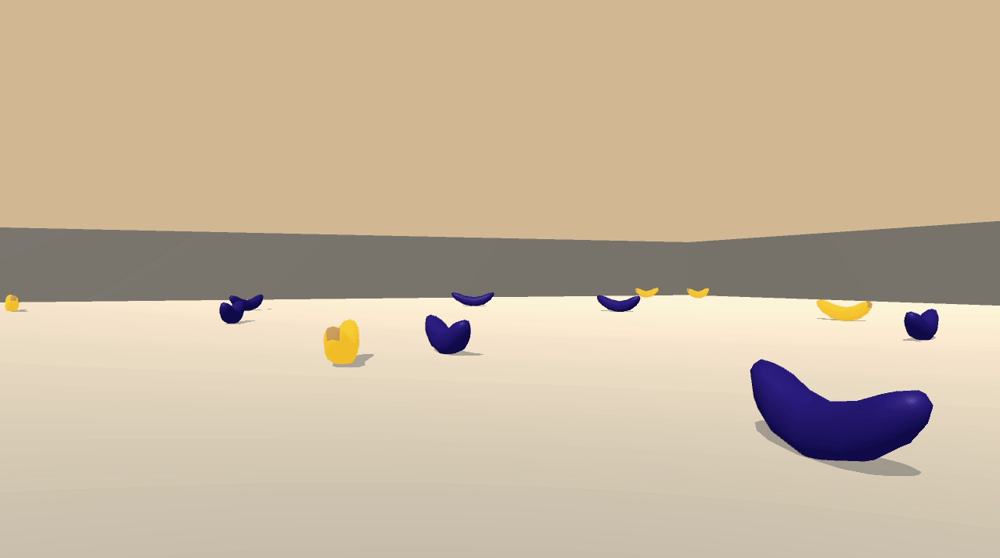
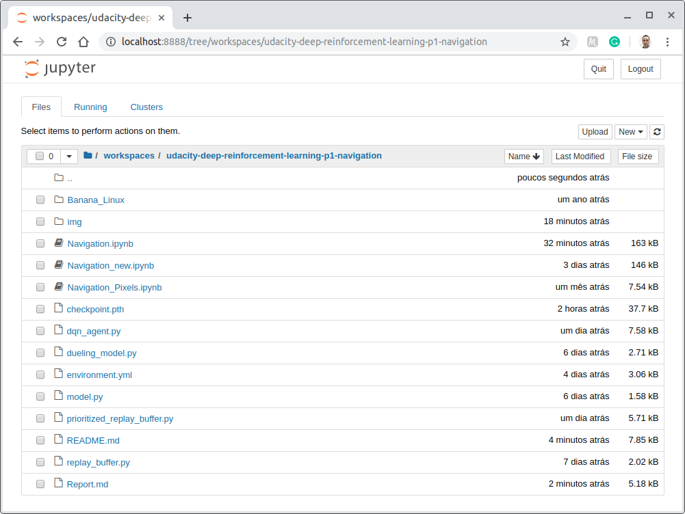
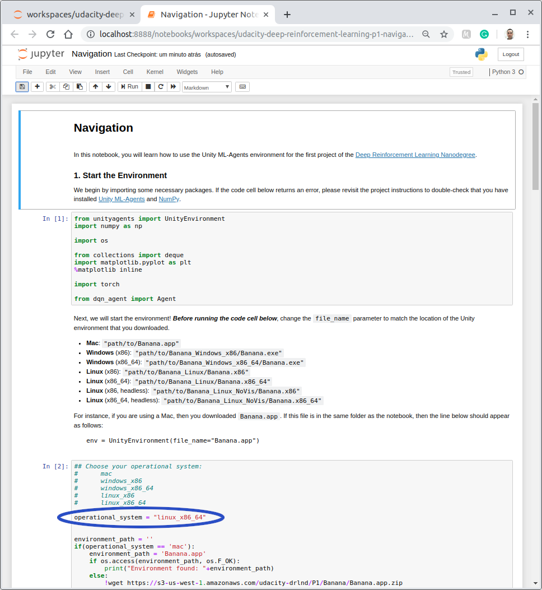
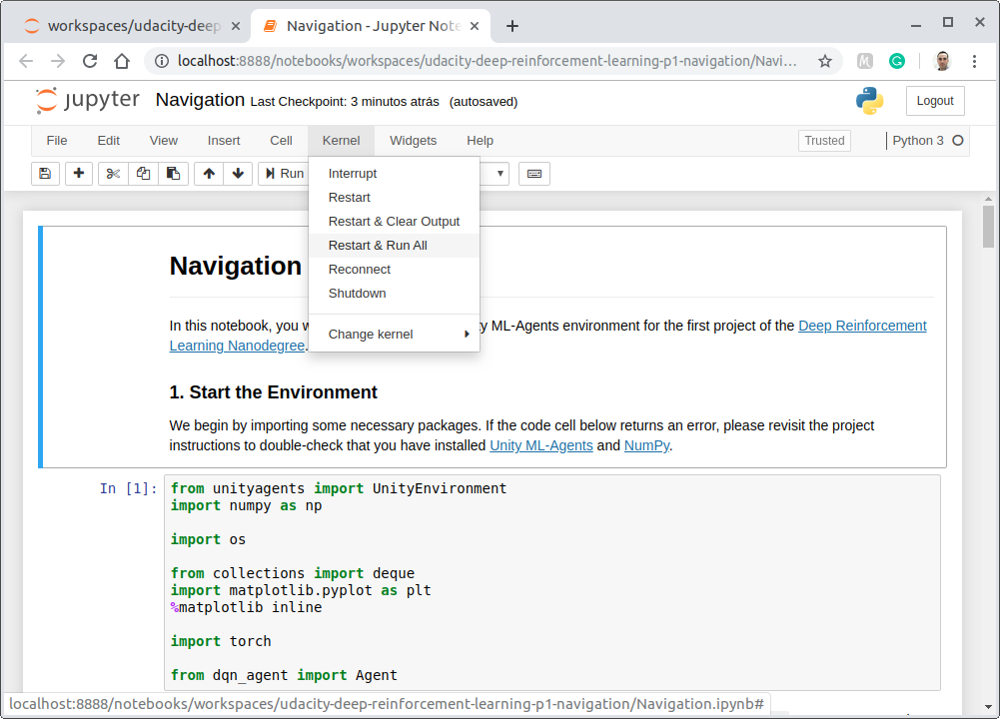

# Project 1: Navigation

## Introduction
This project is part of the [Deep Reinforcement Learning Nanodegree Program](https://www.udacity.com/course/deep-reinforcement-learning-nanodegree--nd893), by Udacity.  

The goal in this project is to create and train an agent to navigate and collect bananas in a large, square world.  



## Understanding the environment
This environment has been built using the **Unity Machine Learning Agents Toolkit (ML-Agents)**, which is an open-source Unity plugin that enables games and simulations to serve as environments for training intelligent agents. You can read more about ML-Agents by perusing the [GitHub repository](https://github.com/Unity-Technologies/ml-agents).  

The project environment provided by Udacity is similar to, but not identical to the Banana Collector environment on the [Unity ML-Agents GitHub page](https://github.com/Unity-Technologies/ml-agents/blob/master/docs/Learning-Environment-Examples.md#banana-collector).  

In this environment, an Agent navigates a large, square world collecting bananas. Each episode of this task is limited to 300 steps. A reward of **+1** is provided for collecting a yellow banana, and a reward of **-1** is provided for collecting a blue banana. Thus, the goal of the agent is to collect as many yellow bananas as possible, avoiding the blue ones.

#### State and action spaces
The state-space has **37 dimensions** and contains the agent's velocity, along with the ray-based perception of objects around the agent's forward direction. Given this information, the agent has to learn how to best select actions. **Four discrete actions** are available, corresponding to:

- `0` - move forward
- `1` - move backward
- `2` - turn left
- `3` - turn right

#### Solving the environment
To solve the environment, the Agent must obtain an average score of **+13** over 100 consecutive episodes.


## Included in this repository

* The code used to create and train the Agent
  * Navigation.ipynb
  * dqn_agent.py
  * dueling_model.py
  * model.py
  * prioritized_replay_buffer.py
  * replay_buffer.py
* A file describing all the packages required to set up the environment
  * environment.yml
* The trained model
  * checkpoint.pth
* A Report.md file describing the development process and the learning algorithm, along with ideas for future work
* This README.md file

## Setting up the environment

This section describes how to get the code for this project and configure the environment.

### Getting the code
You have two options to get the code contained in this repository:
##### Option 1. Download it as a zip file

* [Click here](https://github.com/silviomori/udacity-deep-reinforcement-learning-p1-navigation/archive/master.zip) to download all the content of this repository as a zip file
* Uncompress the downloaded file into a folder of your choice

##### Option 2. Clone this repository using Git version control system
If you are not sure about having Git installed in your system, run the following command to verify that:

```
$ git --version
```
If you need to install it, follow [this link](https://git-scm.com/downloads) to do so.

Having Git installed in your system, you can clone this repository by running the following command:

```
$ git clone https://github.com/silviomori/udacity-deep-reinforcement-learning-p1-navigation.git
```
### Installing Miniconda
Miniconda is a free minimal installer for conda. It is a small, bootstrap version of Anaconda that includes only conda, Python, the packages they depend on, and a small number of other useful packages, including pip, zlib, and a few others.  

If you would like to know more about Anaconda, visit [this link](https://www.anaconda.com/).

In the following links, you find all the information to install **Miniconda** (*recommended*)

* Download the installer: [https://docs.conda.io/en/latest/miniconda.html](https://docs.conda.io/en/latest/miniconda.html)
* Installation Guide: [https://conda.io/projects/conda/en/latest/user-guide/install/index.html](https://conda.io/projects/conda/en/latest/user-guide/install/index.html)

Alternatively, you can install the complete Anaconda Platform

* Download the installer: [https://www.anaconda.com/distribution/](https://www.anaconda.com/distribution/)
* Installation Guide: [https://docs.anaconda.com/anaconda/install/](https://docs.anaconda.com/anaconda/install/)

### Configuring the environment
The `environment.yml` file included in this repository describes all the packages required to set up the environment.  
Run the following commands to configure it.

```
$ conda env create -f environment.yml  
$ conda activate drlnd-p1-navigation  
```

## How to train the Agent
The environment you have just set up has the files and tools to allow the training of the agent.  

Start the Jupyter Notebook server by running the commands below. A new browser tab will open with a list of the files in the current folder.

```
$ conda activate drlnd-p1-navigation
$ jupyter notebook
```

If you are keen to know more about notebooks and other tools of Project Jupyter, you find more information on [this website](https://jupyter.org/index.html).

Navigate to the root of the project in your system and click on the `Navigation.ipynb` notebook.  
  

You must to set your operational system by changing the value of the variable `operational_system` in the second cell code.  
The options available are:

* mac
* windows_x86
* windows\_x86\_64
* linux_x86
* linux\_x86\_64  



You can train the agent clicking on the menu bar `Kernel` and then `Restart & Run All`.  
  


### Adjusting the Hyperparameters
To experiment with how the Agent learns through distinct parameters, you can tune these variables:  

**1.** In the **Navigation.ipynb** file  

* n_episodes: Maximum number of training episodes
* max_t: Maximum number of timesteps per episode
* eps_start: Starting value of epsilon, for epsilon-greedy action selection
* eps_end: Minimum value of epsilon
* eps_decay: Multiplicative factor (per episode) for decreasing epsilon  

**2.** In the **dqn_agent.py** file

* BUFFER_SIZE: Replay buffer size
* BATCH_SIZE: Minibatch size
* GAMMA: Discount factor for expected rewards
* TAU: Multiplicative factor for updating the target network weights
* LR: Learning rate
* lr_decay: Multiplicative factor of learning rate decay
* UPDATE_EVERY: How often to update the network
* hidden_layers: Number and size of the Deep Q-Network layers
* USE\_DOUBLE\_DQN: whether or not to use Double Deep Q-Network algorithm
* USE\_DUELING\_NETWORK: whether or not to use Dueling Network algorithm
* USE\_PRIORITIZED\_REPLAY: whether or not to use Prioritized Experience Replay
* alpha: determines how much prioritization is used; α = 0 corresponding to the uniform case
* beta: amount of importance-sampling correction; β = 1 fully compensates for the non-uniform probabilities
* beta_scheduler: multiplicative factor (per sample) for increasing beta (should be >= 1.0)


## Uninstall
If you wish to revert all the modifies in your system, and remove all the code, dependencies and programs installed in the steps above, you will want to follow the next steps.

### Uninstall Miniconda or Anaconda
To do so, please refer to [this link](https://docs.anaconda.com/anaconda/install/uninstall/).


### Remove the code
Simply delete the entire folder containing the code you downloaded in the step "Getting the code"

