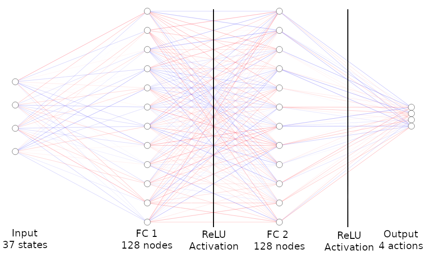
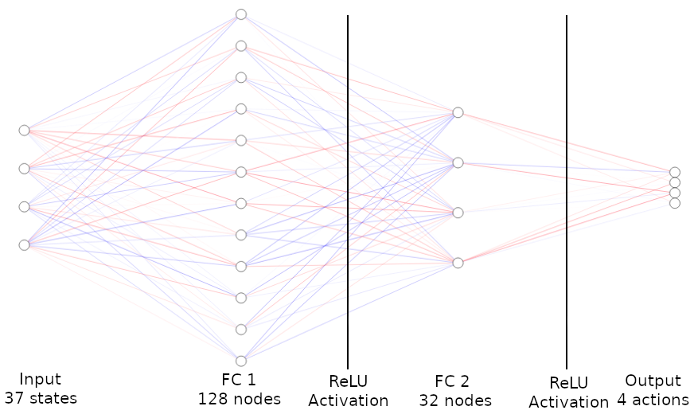
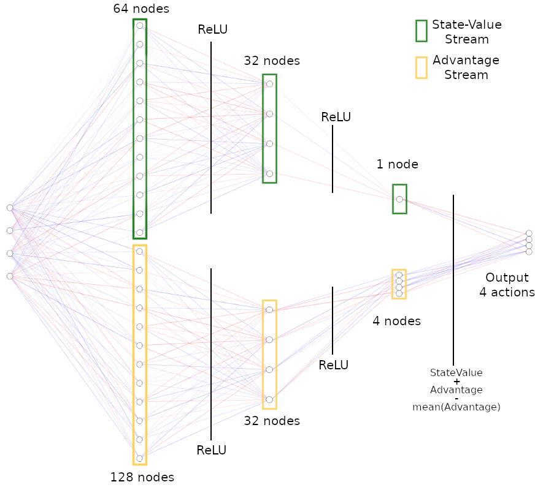
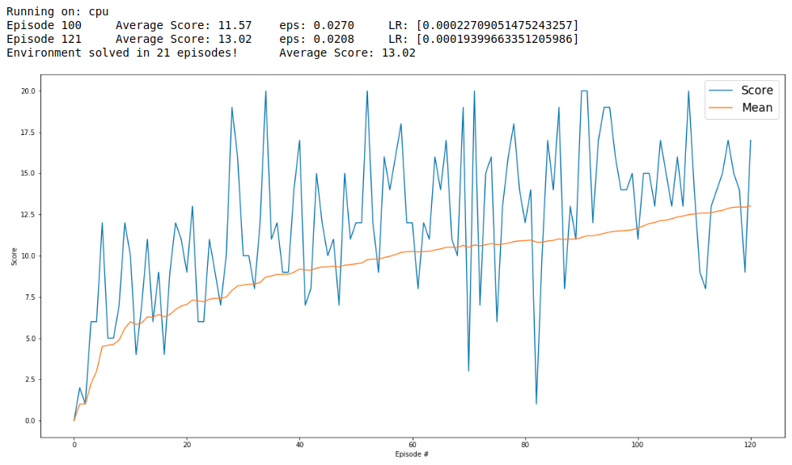

# Project 1: Navigation

## Description of the implementation

### Algorithms
In order to solve this challenge, I have explored and implemented some of the cutting-edge deep reinforcement learning algorithms, such as:

* [Deep Q-Network](https://storage.googleapis.com/deepmind-media/dqn/DQNNaturePaper.pdf)
* [Double Deep Q-Network](https://arxiv.org/abs/1509.06461)
* [Dueling Q-Network](https://arxiv.org/abs/1511.06581)
* [Prioritized Experience Replay](https://arxiv.org/abs/1511.05952)

##### Deep Q-Network
I began this project by implementing a Deep Q-Network (DQN) using Experience Replay and Fixed Q-Targets. That would be my starting point. So, I would implement other algorithms while having an initial model to compare.  

In my first attempt, I built a DQN with **2 fully-connected (FC) layers, 512 nodes each one**. This model solved the environment in 801 episodes.  
  

Then, I changed that model to include more layers and to increase the number of nodes. After some tests, I realized that a lighter network would perform better. So, I built a model with **2 FC layers, 128 nodes each**. This architecture solved the environment in 430 episodes.  
  

At this point, the better model I found was one containing **2 FC layers, with 128 nodes in the first layer and 32 nodes in the second one**. This model solved the environment in 344 episodes. That would be my standard model for future comparison.  
  

##### Double Deep Q-Network
Then, I studied and implemented the Double Deep Q-Network algorithm (DDQN). This technique aims to reduce the overestimation detected in the vanilla Deep Q-Network architecture while training in some Atari 2600 games.  
However, this approach did not improve the results of this project. I performed some tests, as well as some changes in the network, but I could not get a better result than my first model. The better model I found was a network with **2 FC layers, 128 and 32 nodes respectively**, which solved the environment in 390 episodes.  

##### Prioritized Experience Replay
I imagined that the DDQN might work better if operating all together with other algorithms. Thus, I pursued to implement the Prioritized Experience Replay algorithm. This framework aims to replay significant experiences more frequently, turning the learning process more efficient. Despite that, the initial tests showed both DQN and DDQN results worsen when using prioritized replay.  

##### Dueling Network
Thus, I moved forward for one more improvement. I changed the network architecture to work as proposed in the Dueling Network paper. So now, I had available for tests a Dueling Double Deep Q-Network with Prioritized Experience Replay.  
In spite of being a quite appealing approach, I did not get a better result than the first vanilla DQN model.  
  

### Hyperparameters
I am aware that the set of hyperparameters that work well with one architecture might not fit for others.  

Thus, my next step was an extensive tunning phase on the hyperparameters. I could not accept those new algorithms performing worse than a simpler model.  

Within this phase, I also revisited the papers and my implementations to verify if I had written the code correctly.  

In addition to that, I added **schedulers** to the **learning rate** and to the **importance-sampling exponent (β)**.  

This phase took me a very long time! It's a quite exhaustive task since a minimal change in one hyperparameter can lead to a big change in the final result.  
I included in the table below some of the most relevant tests I have done. In green, the best result for each architecture.  

<iframe src="./img/hyperparameters_tests.html" seamless width="100%" height="500px"></iframe>

In the end, the result I got worth all the effort I put in this phase.  
My Agent was able to solve the environment in impressive only **21 episodes**!!  

## Plot of Rewards
This graph shows the rewards per episode within the training phase, as well as the moving mean.  
It illustrates that the Agent is able to receive an average reward of at least +13 over 100 episodes.  

In this case, the Agent solved the environment after **21 episodes**.

## Trained Agent
In the GIF below, you can watch the trained Agent collecting bananas in the environment within one episode.  
  

## Conclusion
In spite of being able to solve the environment in only 36 episodes, DQN architecture was enhanced by those proposed algorithms to solve the environment even faster!  

## Ideas for Future Work

1. Although I have spent a great deal of time tailoring the hyperparameters, there may be other sets of values that conduce the Agent to solve the environment even faster. Thus, more tests might be performed to verify that.    

2. The goal for this project was getting a reward of +13 over 100 episodes. Other tests might verify if this architecture can solve the same environment with a higher score.  

3. Negative rewards could be introduced to discourage the Agent from taking aleatory moves away from its goal of pursuing yellow bananas.  

4. There are other algorithms proposed to enhance the performance of the Deep Q-Network. One future work could implement them to verify their performance in this environment. Those algorithms are:  
   * [A3C - Asynchronous advantage actor-critic](https://arxiv.org/abs/1602.01783)  
   * [Noisy DQN](https://arxiv.org/abs/1706.10295)  
   * [Distributional DQN](https://arxiv.org/abs/1707.06887)  

